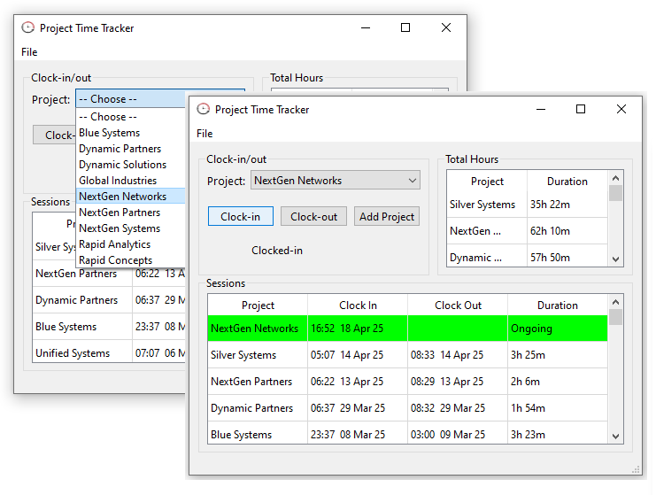
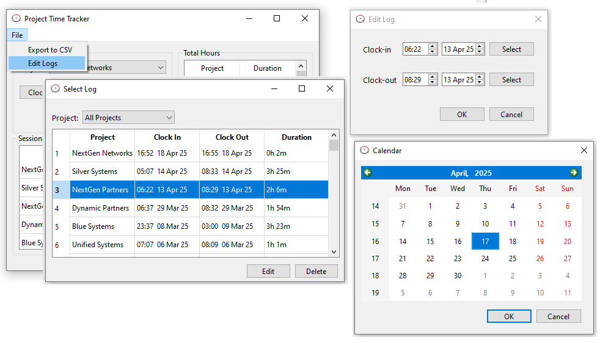

# Project Time Tracker

A lightweight desktop application for tracking time spent on projects, built with Python, PyQt6, and SQLite.

## Overview

This application provides a simple and structured way to log work sessions, manage project entries, and export time data. It was designed as a practical tool for tracking development and engineering work, with a focus on clarity, usability, and clean separation between logic and UI.

## Features

* Clock in / clock out tracking
* Manual entry editing
* Entry deletion
* Project-based organisation
* CSV export of tracked time
* Simple and responsive desktop UI

## Architecture

The application is structured with a clear separation of concerns:

* **GUI Layer (PyQt6)**
  Handles user interaction and display.

* **Core Logic Layer**
  Manages time tracking, entry creation, and state handling.

* **Persistence Layer (SQLite)**
  Stores project and time entry data locally.

This separation allows the core tracking logic to remain independent of the interface, making it easier to extend or reuse in other contexts.

## Example Workflow

1. Select or create a project
2. Start tracking time (clock in)
3. Stop tracking when finished (clock out)
4. Review, edit, or delete entries
5. Export results to CSV if needed

## Screenshots

Here are some screenshots of the application in action:

- **Clock In/Clock Out Interface**:

  

- **Edit/Delete Logs**:

  
  
## Installation

Clone the repository:

```bash
git clone https://github.com/xMattC/Project-time-tracker.git
cd Project-time-tracker
```

Create and activate a virtual environment:

```bash
python -m venv venv
```

Windows:

```bash
venv\Scripts\activate
```

macOS/Linux:

```bash
source venv/bin/activate
```

Install dependencies:

```bash
pip install -r requirements.txt
```

Run the application:

```bash
python main.py
```

## Data Storage

All data is stored locally using SQLite. No external services are required.

## Planned Improvements

* Improved validation for time entries
* Enhanced CSV export formatting
* Unit tests for core tracking logic
* Packaging for easier distribution

## Purpose

This project demonstrates:

* Desktop application development with PyQt6
* Separation of UI and business logic
* Local data persistence with SQLite
* Practical tooling for time tracking workflows
