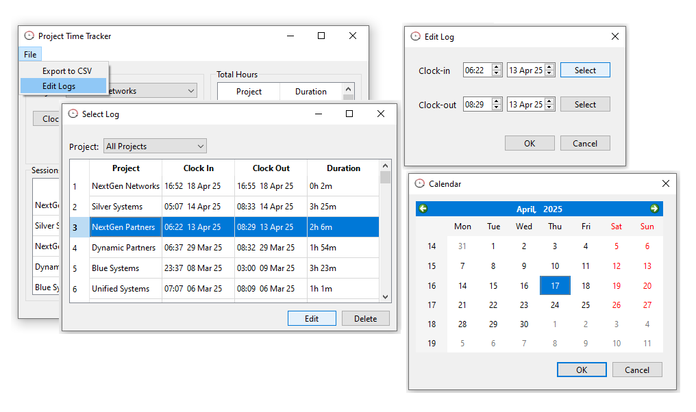

# Hour Tracker Project

This Python project is designed to help track hours for various projects, following a simple clock-in/clock-out style. It includes a modular structure, utilizing Flask for the backend API and PyQt6 for a graphical user interface (GUI). Whether you're tracking billable hours for clients or managing your personal project time, this tool is flexible and easy to use.

## Technologies Used

- **Python**: Core language for backend functionality, data handling, and business logic.
- **Flask**: Web framework to implement a REST API for managing time tracking records.
- **PyQt6**: Framework used to create the desktop GUI for user interaction.
- **SQLAlchemy**: ORM for database management and persistence of time logs.
- **SQLite**: Lightweight relational database for storing time entries.
- **pytest**: Unit testing framework to ensure the codebase is robust and error-free.
- **Git**: Version control to manage project code.

## Features

- **Clock In/Out**: Start and stop tracking time for specific projects with ease.
- **Edit Logs**: Modify time entries if corrections or updates are needed.
- **Delete Logs**: Remove time entries that are no longer relevant or were entered incorrectly.
- **Export to CSV**: Export time logs into a CSV format for external use or further analysis.
- **Generate Reports**: View summarized reports based on time entries for specific projects or tasks.


## Screenshots

Here are some screenshots of the application in action:

- **Clock In/Clock Out Interface**:

  

- **Edit/Delete Logs**:

  


## Installation Instructions

### Step 1: Clone the Repository

Clone the repository to your local machine:

```bash
git clone https://github.com/your-username/hour-tracker.git
cd hour-tracker
```

### Step 2: Set Up a Virtual Environment

(Optional but recommended) Create a virtual environment to manage dependencies:

```bash
python -m venv venv
```

Activate the virtual environment:

- On Windows:
  ```bash
  venv\Scripts\activate
  ```
- On macOS/Linux:
  ```bash
  source venv/bin/activate
  ```

### Step 3: Install Dependencies

Install the required dependencies:

```bash
pip install -r requirements.txt
```

## Usage

### Running the Application

You can run the application to use the GUI or the Flask API.

#### PyQt6 GUI

To launch the GUI:

```bash
python main.py
```

The application window will open, allowing you to:
   - **Clock In**: Start tracking time for a specific project.
   - **Clock Out**: End the tracking for the current project.
   - **Edit Logs**: Modify existing time entries as needed.
   - **Delete Logs**: Remove any unnecessary or incorrect time entries.
   - **View Reports**: Generate reports based on logged time.
   - **Export to CSV**: Export your time logs to a CSV file for further use.

### Database

The project uses a **SQLite** database to store time logs. The database will be automatically initialized when the application runs for the first time.


## Contributing

Contributions to the project are welcome! If you have suggestions or improvements, feel free to fork the repository, make changes, and submit a pull request.

## License

This project is licensed under the MIT License - see the [LICENSE](LICENSE) file for details.
